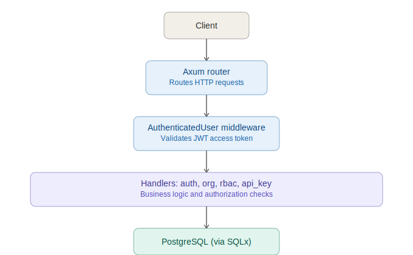
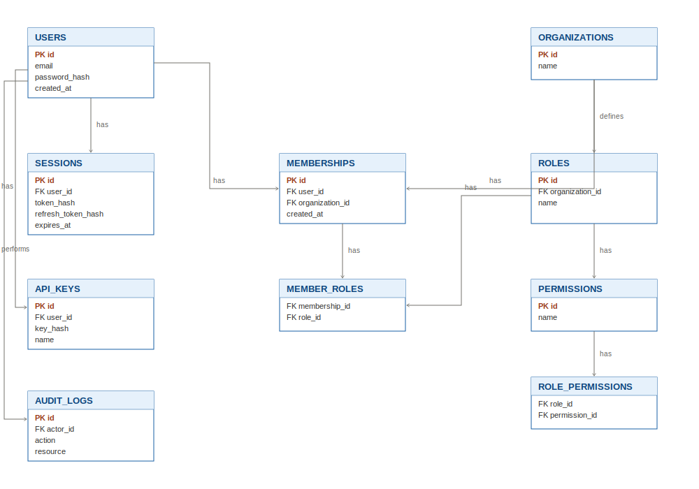
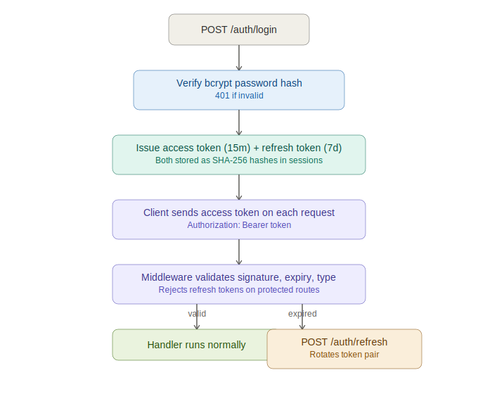

# Technical design document — IAM platform

## 1. System overview

This platform is an Identity and Access Management (IAM) backend, similar in spirit to Auth0, Clerk, or Keycloak, built with Rust, Axum, and PostgreSQL. It answers three questions for every request: who is the user, which organization are they acting in, and are they allowed to perform this specific action.

The system models a standard multi-tenant hierarchy: users register accounts independently of any organization. They then create or join organizations. Within an organization, users hold one or more roles, and each role carries a set of permissions. When a user attempts an action scoped to an organization (for example, updating organization settings), the system checks whether any of their roles in that organization carry the required permission.

Alongside this core authorization engine, the platform provides session management (so users can see and revoke active logins), API key issuance (for programmatic access without a password), and audit logging (a traceable history of sensitive actions).

## 2. Architecture



The application is a single Axum binary backed by one PostgreSQL database. There is no separate service layer or message queue; at this scale a monolith with clear module boundaries is the right tradeoff (see Tradeoffs section).

Request flow: a client sends an HTTP request, which the Axum router matches to a handler function. For any route requiring authentication, the `AuthenticatedUser` extractor runs first as part of Axum's `FromRequestParts` mechanism — it pulls the `Authorization` header, decodes and validates the JWT, and rejects the request before the handler body ever executes if the token is missing, malformed, expired, or the wrong type (refresh tokens cannot be used as access tokens). If validation succeeds, the handler receives a `user_id` and proceeds with its business logic, which in most cases includes an explicit RBAC permission check before touching the database, then a database operation via SQLx, and finally a response.

Code is organized by domain, not by technical layer:

```
src/
  main.rs              route table, server startup, migrations
  middleware.rs         AuthenticatedUser JWT extractor
  models.rs             request/response structs, Claims
  handlers/
    auth.rs              register, login, refresh, logout, sessions, profile
    org.rs               organizations, memberships, permission checks
    rbac.rs              roles, permissions, role-permission assignment
    api_key.rs           API key lifecycle
```

This is a deliberately flat structure rather than the `handlers/services/repositories` split suggested in the assignment brief. Handlers call SQLx directly rather than going through a separate repository layer. For a project of this size, an extra abstraction layer between the handler and the query would add indirection without adding testability, since SQLx's compile-time-checked queries already give strong correctness guarantees. If the schema or query complexity grows significantly, extracting a repository layer per entity would be the natural next refactor.

## 3. Database design



See the ERD shared in this conversation for the full entity relationship diagram. The schema is split across four migrations, applied in order by `sqlx::migrate!` at startup:

- `init_schema` — users, organizations, memberships, roles, permissions, and the two join tables (`role_permissions`, `member_roles`)
- `add_sessions_and_audit` — sessions and audit_logs
- `create_api_keys` — api_keys
- `add_refresh_tokens` — adds refresh token columns to sessions

**Key design decisions:**

Memberships is a join table between users and organizations, carrying a `unique_user_org` constraint so a user cannot be added to the same organization twice. Roles belong to a single organization (`roles.organization_id`) rather than being global, because role names like "Owner" or "Admin" are meaningful only within the context of one organization — Acme's Admin role and Globex's Admin role are different rows with potentially different permissions.

Permissions are global rather than per-organization. A permission like `user:create` represents a fixed capability in the system; organizations don't invent their own permission types, they only choose which existing permissions to attach to their roles. This keeps the permission set auditable and prevents permission sprawl.

Two many-to-many join tables connect the hierarchy: `role_permissions` links roles to permissions, and `member_roles` links a membership (not a user directly) to a role. The membership indirection matters — a user's roles are scoped to a specific organization through their membership row, so the same user can hold "Owner" in one org and no role at all in another.

All foreign keys use `ON DELETE CASCADE` except `audit_logs.actor_id`, which uses `ON DELETE SET NULL`. This is intentional: deleting a user should clean up their memberships and sessions, but audit history should survive even if the actor who performed an action is later deleted, otherwise the audit trail would have holes.

Sensitive values are never stored in plaintext. Passwords are hashed with bcrypt. JWT access tokens, refresh tokens, and API keys are all hashed with SHA-256 before being written to the database; only their hashes are stored, and the plaintext API key is shown to the user exactly once at creation time.

## 4. API documentation

The full endpoint reference, including auth requirements, lives in the project README. In summary, the API exposes five resource groups: auth (register, login, refresh, logout), users (profile), sessions (list, revoke), organizations (CRUD, membership management), roles and permissions (CRUD plus assignment endpoints), and API keys (create, list, delete).

Status codes follow standard REST conventions: `201` for creation, `200` for reads and updates, `204` for deletes, `401` for missing or invalid authentication, `403` for authenticated-but-unauthorized requests, `404` for missing resources, `422` for invalid input, and `500` reserved for genuine server-side failures (database errors, hashing failures) rather than being used as a catch-all.

## 5. Authentication flow



See the auth flow diagram shared above for the full sequence. The summary: login verifies the bcrypt password hash, then issues two JWTs — a 15-minute access token and a 7-day refresh token — both of which are hashed and stored in the sessions table alongside their respective expiry times. The client sends the access token on every subsequent request via the `Authorization: Bearer` header.

Each JWT carries a `token_type` claim of either `"access"` or `"refresh"`. The `AuthenticatedUser` middleware explicitly rejects any token where `token_type != "access"`, which prevents a client from using a long-lived refresh token to authenticate normal requests — refresh tokens have exactly one valid use, hitting `/auth/refresh`.

When the access token expires, the client calls `POST /auth/refresh` with the refresh token. The server validates the refresh token's signature and type, looks up the matching session row by its hash, confirms it hasn't expired, and then rotates both tokens — issuing a brand new access/refresh pair and overwriting the old hashes in the same session row. The old refresh token is immediately unusable after this, which limits the blast radius if a refresh token is ever leaked: it can be used once before rotation invalidates it.

## 6. Design decisions

**JWT over server-side-only sessions.** JWTs let the access-token validation path avoid a database round trip on every request — the signature check alone proves the token is valid, which matters for a system whose entire job is gatekeeping. The session table exists alongside JWTs specifically to support revocation (a pure JWT system can't be revoked before expiry without a blocklist), so this is a hybrid: stateless validation for speed, with a stateful session record for visibility and revocation.

**Refresh token rotation rather than static refresh tokens.** Rotating the refresh token on every use means a stolen refresh token is only useful until the legitimate client's next refresh call, at which point the stolen copy becomes invalid. This is a standard mitigation against long-lived token theft, at the cost of slightly more write traffic to the sessions table.

**Permissions are seeded data, not user-creatable in practice.** Although `POST /permissions` exists, the realistic workflow is that the permission set is fixed by the platform (seeded in the initial migration) and organizations only assign existing permissions to their roles. This mirrors how AWS IAM and similar systems work — the action catalog is owned by the platform, not by tenants.

**API keys and session tokens are both SHA-256 hashed, never the raw value.** This was actually a gap caught during a self-audit of this codebase (sessions originally stored a raw JWT prefix) and fixed to be consistent with how API keys were always handled. Storing only a hash means a database breach doesn't hand over usable credentials.

**Audit logs use a flexible free-text `action` and `resource` rather than a fixed enum or separate tables per event type.** This keeps the table simple and extensible — adding a new audited action is just a new string constant in a handler, not a schema migration.

## 7. Tradeoffs

**Monolith instead of services-per-domain.** A single Axum binary is simpler to develop, test and deploy than splitting auth, RBAC and API keys into separate services. The cost is that everything currently scales together; if API key validation traffic ever dramatically outpaced everything else, it couldn't be scaled independently. For the current scope, this tradeoff favors simplicity.

**No Redis caching for permission checks.** Every `check_permission` call hits PostgreSQL with a join across five tables (memberships → member_roles → roles → role_permissions → permissions). This is correct and simple but not the fastest possible path at high request volume. Caching role-permission lookups in Redis was considered and deferred — it's listed as a "Recommended" feature in the project spec rather than mandatory and introducing a cache invalidation strategy (what happens when a role's permissions change mid-cache-lifetime) adds real complexity that isn't justified until the access-check path is demonstrated to be a bottleneck.

**Sessions table stores both access and refresh token hashes in one row rather than two separate tables.** This keeps the schema simpler (one row per login, easy to query for "active sessions") at the cost of slightly conflating two different lifecycles (15 minutes vs. 7 days) in one row. A two-table design would let access tokens be revoked independently of their refresh token, which isn't currently needed since logout already revokes the whole session.

**API keys have no expiry or scopes yet.** The spec lists these as optional fields. They were deliberately deferred in favor of getting the core CRUD and hashing behavior correct first; adding an `expires_at` column and a `scopes` text array would be a small follow-up migration if the project's scope expands.
